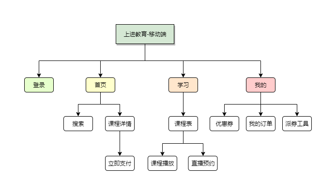

## 1. 概述
### 1.1 需求背景

先前的“上进学社”业务中，新兴业务（如 AI 绘画和影视后期课程）获得了显著的营收增长，而传统业务（例如读书计划、考证课程等）的营收表现较差。在转化模式方面，“上进学社”采用私域和公域两种不同的方式进行客户转化，并且面临着前端转化和历史业务逻辑复杂等问题。鉴于此，推出**全新**项目**“上进教育”**，以专注于迎接新业务的挑战和发展需求。
而为满足业务需求，“上进教育”将作为现有“上进学社”业务的补充，推出新的项目框架，用于承接新业务。

## 2. 相关文档

- [需求文档](https://2jr8oc.axshare.com/#id=ltduwr&p=%E9%9C%80%E6%B1%82%E8%83%8C%E6%99%AF&g=1) (产品经理：郑鸿鑫)
- [接口文档](https://console-docs.apipost.cn/preview/6b849db464e969f7/46caf483ffc3651b) (后端人员：陈耿盛、林识构、林建彬)
- [UI 设计稿](https://lanhuapp.com/link/#/invite?sid=lX0WTMjb) (陈玉婷)

## 3. 总体设计

### 3.1 全貌图


### 3.2 模块说明


## 4. 关键业务/功能模块的实现

### 4.1 邀约注册

#### 4.1.1 功能说明

在订单支付前，判断“当前跟进人”并对订单进行绑定。

#### 4.1.2 流程说明

“当前跟进人”写入时机：
1. 在注册时，携带推荐人/邀约人参数
2. 老师分享课程携带邀约参数（？购买前？购买后-不同老师分享同一个课程、老师提供上课链接..）

#### 4.1.3 模块详细设计

由于业务需求，订单支付前，需要判断当前是否携带了跟进人参数，是则直接进行绑定，否则获取历史绑定的跟进人参数。所以需要在数据库存档，并在接口实现自动绑定，前端在订单支付前无需处理。
前端需要在 1. 注册时携带的推荐人/邀约人和 2. 用户点击老师分享课程携带邀约参数的链接进入系统 的这两种时机，请求接口记录/更新该用户当前跟进人的绑定。

### 4.2 首页内容动态渲染

#### 4.2.1 功能说明

移动端首页的内容通过管理后台的**可视化**配置功能进行配置和预览，使得移动端可以根据配置的数据展示页面内容，提高了运营人员的友好体验。同时，这种方法也提高了新模块开发的可扩展性，无需按照原有流程先新增模块菜单，然后开发前端的增删改查页面，以及相应的后端数据库表设计和增删改查接口。这种方式允许后端接口处理兼容新的数据，而无需修改数据库表和接口，有效节省了开发成本。

#### 4.2.2 流程说明
后台管理系统自定义组件：
1. 瓷片区组件
2. 图片组件
4. 视频组件
3. 课程组件

通过可视化拖拉效果，进行页面内容布局、排序和属性配置等功能，实现高度灵活的移动端首页内容展示。
#### 4.2.3 模块详细设计

通过后台管理系统配置移动端首页内容，移动端请求接口返回的配置数据，类似地：
```json
[
	{type:'search',uuid:'唯一标识',sort:0,config:{placeholder:'请搜索你感兴趣的课程'}},
	{type:'tab',uuid:'唯一标识',sort:1,config:{list:[{tabName:'推荐',imgUrl:'xxx'},tabName:'AI绘画',imgUrl:'xxx'}]}},
	{type:'icon',uuid:'唯一标识',sort:2,config:{list:[{tabName:'推荐',imgUrl:'xxx'},tabName:'AI绘画',imgUrl:'xxx'}]}}
	{type:'course',uuid:'唯一标识',sort:3,config:{courses:[],layout:'col-1',direction：'vertical'}},
]
```
移动端首页通过循环数组中的 `type` 标识，判断并渲染对应组件内容。（注意课程组件中，课程列表配置和移动端请求时的数据同步性）
## 4.3 支付方式
### 4.3.1 功能说明
此次需求要求订单支付方式支持微信支付和支付宝支付。
### 4.3.2 流程说明
需要做接入前准备，如公众号后台相关配置、账号申请、参数签名等，具体请查看文档。
微信支付：[接入前准备](https://pay.weixin.qq.com/docs/merchant/products/jsapi-payment/preparation.html)
支付宝支付：[接入准备](https://opendocs.alipay.com/open/203/107084?ref=api)
### 4.4 分享
### 4.4.1 功能说明
在此次需求中，涉及课程分享和派券工具-分享等需要使用到**自定义**“分享给朋友”、“分享到朋友圈”功能。
### 4.4.2 流程说明
需要通过使用微信JS-SDK，使用微信自定义分享的能力。
> [微信JS-SDK说明文档](https://developers.weixin.qq.com/doc/offiaccount/OA_Web_Apps/JS-SDK.html)

## 5. 技术分析 Checklist

|序号|技术分析自检项|自检结果|
|:--:|:--|:--:|
|1|本次改造对原有功能需求的影响范围，包括以前交互，视觉设计|新项目|
|2|是否可提取出公用组件|是|
|3|数据结构变更是否考虑老数据兼容|否|
|4|是否影响其他端(移动端、小程序端等）|只针对 H5 |
|5|操作是否考虑了防重处理|是|
|6|兼容性处理|支付环境|
|7|······||
## 6. 项目排期

### 6.1 任务拆分、工时预估
[上进教育-第一期](https://doc.weixin.qq.com/sheet/e3_AbwAogYYAGktM3efc9wQ3iFLoB9QD?scode=AKQAXQc6AFAs5wiC0xATsAUQYyAJ0&tab=axjnpa)
### 6.2 项目里程碑
|事项|日期|
|:-:|:-:|
|需求评审| 2024 年 04 月 22 日 |
|技术评审| 2024 年 05 月 30 日 |
|开发完成| - |
|版本提测| - |
|版本发布| - |
