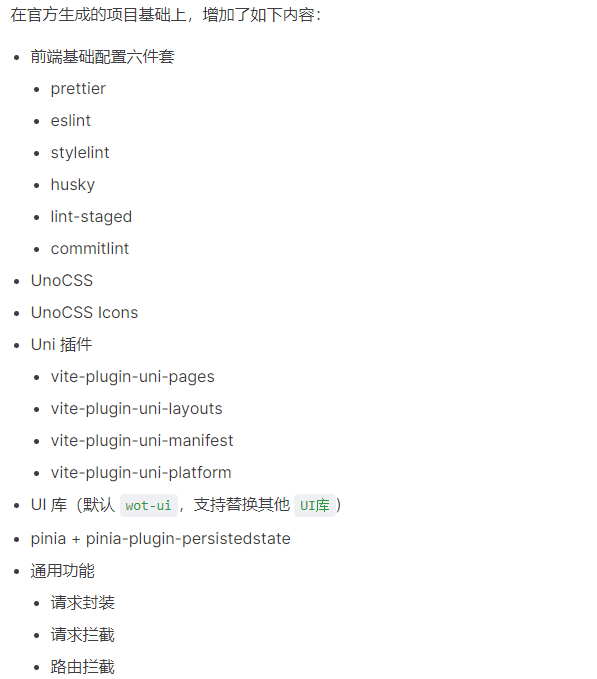
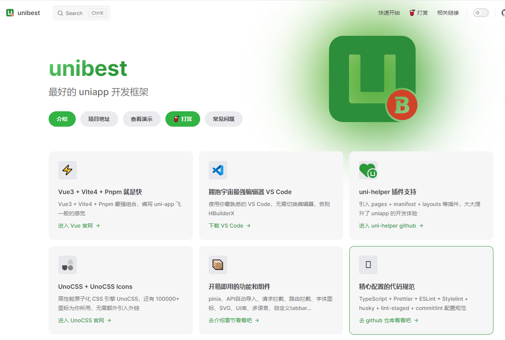
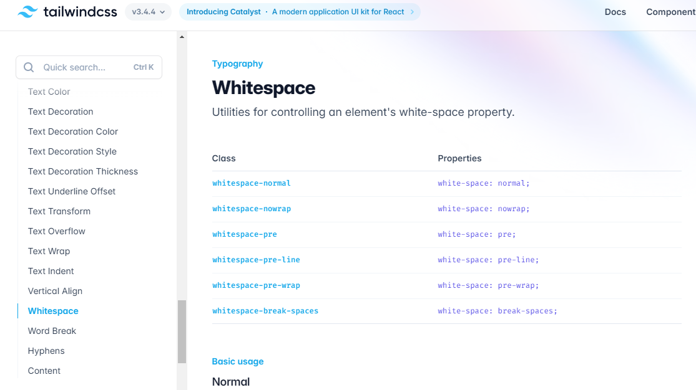
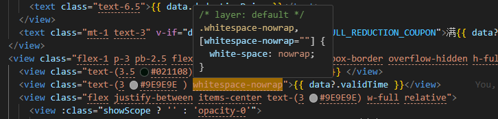

## 动机

- **提高项目启动效率**：旨在节省新项目启动阶段在配置上的时间浪费，加快项目进展，提高整体开发效率。
- **倾向于新技术与框架**：拥抱新技术或框架，结合主流插件并整合现代开发架构，以提高开发效率和项目质量。
- **统一技术栈，规范开发流程**：统一技术栈，降低团队成员跨技术栈的学习成本，帮助保持团队开发规范一致性，并提高项目的可维护性和扩展性。

## 目标

- **技术前沿性**：拥抱新技术，确保系统具备较长期的发展空间，同时能够满足未来需求的变化。
- **基础功能完备性**：确保搭建的启动模板能够满足移动端项目的基本开发功能需求，如通用的组件封装、常用的工具提供等。
- **快速上手，团队匹配度高**：优先考虑团队已有的技术栈和技能，能够使团队快速上手，减少学习成本和上手时间，以及后期维护人员和开发成本。
- **避免过度设计，一切从简**：在技术选型和搭建过程中，避免过度设计和过度复杂的架构，以简化开发流程，提高开发效率。
- **灵活性高和可扩展性强**：确保所选技术栈具有良好的灵活性和可扩展性，降低后续系统升级和扩展的复杂度。
- **!!#000000 拥有跨端能力!!**：实现一套代码生成跨平台多端应用，让启动模板满足更广泛的项目需求和场景（结合团队情况，此模板的侧重点是 H5 和小程序端）。

## 候选技术列表

针对上述技术选型的目标，以及结合团队情况和业务情况，可以基本确定技术选型的方向：

1. 选择 **Vue** 而不是 **React**：与团队目前的技术栈匹配度高，国内 vue 使用率更高，起手成本低，维护成本或后期因人员变动招人成本更低。
2. 跨端的技术框架，国内主流的选择 uniapp 和 taro 、flutter，相比之下，很明显首选 **uniapp**。
3. 采用 **纯 CLI 方式**开发，摆脱 uniapp 推荐的 HBuilderX 编辑器限制，自由选择编辑器，提升开发灵活性与效率。
4. 选择**现有启动模板**，而不是**从零到一**搭建：节约时间成本，尽可能的利用主流技术红利，采用主流的开源方案，避免重复造轮子。
5. 尽可能使用主流技术：Vite 5、Vue 3、TypeScript、Pinia、各种 Lint 等。

经过搜寻了一番，目前参加对比的启动模板包括：
|2024-05-24| github star | github fork |
| :--- | :---: | :---: |
|**[unibest](https://github.com/codercup/unibest)**| 1.4k | 117|
|[uni-vue3-vite-ts-pinia](https://github.com/ttk-cli/uni-vue3-vite-ts-pinia)| 352 |100|
|[vite-uniapp-template](https://github.com/viarotel-org/vite-uniapp-template)| 285 |55 |
|[vitesse-uni-app](https://github.com/uni-helper/vitesse-uni-app)| 272 | 28 |
|[uni-vitesse](https://github.com/Ares-Chang/uni-vitesse)| 262 | 49 |
|[uni-vue3-ts-template](https://github.com/ATQQ/uni-vue3-ts-template)| 246 |65|

## 技术评估标准

根据技术评估的指标，评估不同技术的优劣势。
技术评估的指标包括但不限于：

- **技术前沿性**：是否使用采用主流的开源方案、技术方案
- **社区支持**：社区活跃程度和问题解决的效率
- **更新迭代**：更新迭代频率和更新内容
- **代码组织**：对代码结构的规范性和组织性
- **文档质量**：是否提供或拥有完善的文档资料
- **工程化支持**：对工程化开发（构建、打包、部署等）的支持程度
- **学习曲线**：前学习上手曲线和团队成员的熟悉程度
- **业务匹配度**：针对现有或未来的业务需求评估匹配程度
- **页面加载速度**：不同前端框架对页面加载速度的影响

## 技术分析

### [unibest](https://github.com/codercup/unibest)

从 github 上的数据看，unibest 有很大的优势。通过上手使用体验，整体方面都合适，确定选择了 unibest 作为启动模板。
**详细分析**：

1. 满足技术前沿性
   
2. 拥有较完善的文档资料([文档地址](https://codercup.github.io/unibest-docs/))
   
3. 基础功能相对完善，提供详细的 [demo 案例]([hello-unibest](https://github.com/codercup/hello-unibest)，对于模板的 UI 组件库 [Wot Design Uni](https://wot-design-uni.netlify.app/) 选型过程也有详细的说明（[UI 库选型篇](https://codercup.github.io/unibest-docs/base/ui/ui)）。
4. 开源热度相对较高，比较活跃。
5. 整体封装实现简洁，可扩展性高，上手难度低。
6. ......

## 改造过程

执行 unibest 脚手架 基于 base 分支创建项目

```bash
pnpm create unibest yz-mobile-template -b base
```

对选型时对比一些模板项目和主流方案中，集其优点“缝合”到项目中，所以在脚手架生成的项目基础上，改动了如下内容：

### **UnoCSS 预设配置调整**

由原来的小程序和非小程序预设配置，调整为统一使用 UnoCSS UniApp 预设 `@uni-helper/unocss-preset-uni`，原因是小程序和 H5 端表现的效果不一样，如 class 属性化使用。
调整前：

```
// uno.config.ts
if (isMp) {
  // 使用小程序预设
  presets.push(presetApplet(), presetRemRpx())
} else {
  presets.push(
    // 非小程序用官方预设
    presetUno(),
    // 支持css class属性化
    presetAttributify(),
  )
}
```

调整后:

```
// uno.config.ts
import { presetUni } from "@uni-helper/unocss-preset-uni";
export default defineConfig({
  presets: [
  	// ...
    presetUni({ attributify: true })
  ],
  // ...
})
```

### **升级了 UnoCSS 版本**

为了体验更多的新特性，由原来的 "\^0.58.9" 版本升级为 "\^0.60.2" 版本，并调整了引用方式。
调整前：

```
// vite.config.ts
import UnoCSS from 'unocss/vite';
export default ({ command, mode }) => {
	// ...
	return defineConfig({
		// ...
		plugins: [
		  // ...
		  UnoCSS()
		]
	})
}
```

调整后：

```
// vite.config.ts
export default ({ command, mode }) => {
	// 动态来导入不支持 cjs 的模块，unocss 0.59.x 及以上仅支持 ESM
	const UnoCSS = await import("unocss/vite").then(i => i.default);
	// ...
	return defineConfig({
		// ...
		plugins: [
		  // ...
		  UnoCSS()
		]
	})
}
```

### **引入 [unplugin-vue-components](https://github.com/unplugin/unplugin-vue-components)**

按需自动导入组件，无需手动 **import** 引入组件。

```
// vite.config.ts
export default ({ command, mode }) => {
	// ...
	return defineConfig({
		// ...
		plugins: [
		  /**
		   * unplugin-vue-components 按需引入组件
		   * 注意：需注册至 uni 之前，否则不会生效
		   * @see https://github.com/antfu/vite-plugin-components
		   */
		  Components({
			dts: "src/types/components.d.ts",
			dirs: ["src/components"]
		  }),
		]
	})
}
```

### **添加 optimizeDeps.include 配置**

在导航到另一个视图时，由于加载依赖而触发页面重新加载，开发起来十分不爽，如以下（或类似）日志（但不会发生在生产版本中）：

```
[vite] ✨ new dependencies optimized: xxx
[vite] ✨ optimized dependencies changed. reloading
```

**optimizeDeps** 主要用于优化项目的依赖项。具体来说，optimizeDeps 选项允许 Vite 在构建时对指定的依赖包进行**预构建**和优化，从而加快开发服务器的启动速度和构建过程。

```
// vite.config.ts
export default ({ command, mode }) => {
	// ...
	return defineConfig({
		// ...
		optimizeDeps: {
		  include: ["wot-design-uni", "weixin-js-sdk"]
		}
	})
}
```

### **引入 vconsole 调试工具**

```
// App.vue
<script setup lang="ts">
// #ifdef H5
import VConsole from "vconsole";
if (!import.meta.env.VITE_HIDE_VCONSOLE) {
  const vConsole = new VConsole();
}
// #endif
</script>
```

### **引入 cz-git **

优雅的提交代码，输出标准格式的 Commitizen 适配器和 CLI。

- 安装

```bash
pnpm install -D cz-git
```

- 添加 **config** 指定使用的适配器

```
// package.json
{
	// ...
	"config": {
		"commitizen": {
		  "path": "node_modules/cz-git"
		}
	},
}
```

- 添加自定义配置

```
// .commitlint.config.cjs
/** @type {import('cz-git').UserConfig} */
module.exports = {
  // ...
  rules: { ... },
  prompt: {
    useEmoji: true,
    types: [
      {
        value: "feat",
        name: "feat:       A new feature",
        emoji: ""
      },
	  // ...
    ],
    // ...
  }
};
```

- 添加命令

```
// package.json
{
	// ...
	"scripts": {
		// ...
		"commit": "git add -A && git-cz && git pull --rebase && git push"
	}
}
```

- 执行命令 `pnpm commit` 就可以优雅的提交代码了
  执行命令，就会得到如下类似效果（命令行提示信息）：
  

### 封装请求返回格式

封装请求统一处理异常，避免每次使用请求时，使用 try catch 包裹，处理成返回格式统一为** [ err , data ]**。
原理是利用 Promise 来处理返回的格式，无论成功与否，都约定返回一个数组，数组的第一个元素为错误对象或者 null (请求成功时)，数组的第二个元素为响应数据或 undefinded (请求失败时)。
处理请求：

```
// src\utils\http.ts
export const http = <T>(options: TCustomRequestOptions) => {
  return new Promise((resolve, reject) => {
    uni.request({
	// ...
 	success(res) {
		// ...
		if (re.success) {
			resolve([null, re.data]);
	  	} else {
			reject(res);
	  	}
      },
      // 响应失败
      fail(err) {
        reject(err);
      }
    });
  }).catch(err => [err]) as Promise<THttpRes<T>>;
};
```

使用：

```
const getData = async () => {
  const [err, data] = await apiGetData();
  if(err) return;
  // ...
};
```

请求成功时：[ err , data ] 等同于** [ null , 响应数据 ]**
请求失败时：[ err , data ] 等同于 **[ 错误信息对象 , undefinded ]**

### **其他改动**：

- 完善 VSCode 配置文件
  - .vscode/extensions.json （同步 VSCode 扩展）
  - .vscode/setting.json （共享一致的编辑器配置）
  - .vscode/vue3.code-snippets （提供个性化的代码片段，快速插入常用代码块）
- 调整相关配置文件，如 .editorconfig，.eslintrc.cjs，.gitignore，.prettierrc.cjs，uno.config.ts，env/ 等等
- 修改 README.md 文件
- 等等

## 目录结构

```shell
.
├─ .husky                   # Husky 配置文件
├─ .vscode                  # VSCode 推荐配置
├─ env                      # vite 环境配置文件
├─ shell                    # 脚本文件
├─ src
│ ├─ api                    # API 接口管理
│ ├─ components             # 全局组件
│ ├─ constants              # 常量定义
│ ├─ enums                  # 项目常用枚举
│ ├─ hooks                  # 常用 Hooks 封装
│ ├─ interceptors           # 拦截器
│ ├─ layouts                # 框架布局模块
│ ├─ pages                  # 项目主包页面
│ ├─ pages-sub              # 项目分包页面
│ ├─ static                 # 静态资源文件
│ ├─ store                  # 状态管理
│ ├─ style                  # 全局样式文件
│ ├─ types                  # 全局 ts 声明
│ ├─ uni_modules            # uni_modules 插件
│ ├─ utils                  # 常用工具
│ ├─ App.vue                # 项目主组件
│ ├─ main.ts                # 项目入口文件
│ ├─ manifest.json          # uni-app 项目配置
│ ├─ pages.json             # uni-app 页面配置
│ └─ uni.scss               # 全局 scss 变量
├─ .gitignore               # 忽略 git 提交
├─ favicon.ico              # 项目图标
├─ index.html               # 入口 html
├─ manifest.config.ts       # 自动生成 manifest.json 配置文件
├─ package.json             # 依赖管理文件
├─ .editorconfig            # 统一编辑器的编码风格
├─ .eslintignore            # 忽略 Eslint 校验
├─ .eslintrc.cjs            # Eslint 校验配置文件
├─ .npmrc                   # npm 配置文件
├─ .prettierignore          # 忽略 Prettier 格式化
├─ .prettierrc.cjs          # Prettier 格式化配置
├─ .stylelintignore         # 忽略 stylelint 格式化
├─ .stylelintrc.cjs         # stylelint 样式格式化配置
├─ commitlint.config.cjs    # git 提交规范配置文件
├─ lint-staged.config.cjs   # lint-staged 配置文件
├─ pages.config.ts          # 自动生成 pages.json 配置文件
├─ README.md                # 说明文档
├─ LICENSE                  # 开源协议
└─ vite.config.ts           # Vite 配置文件
├─ tsconfig.json            # ts 配置文件
├─ uno.config.ts            # UnoCSS 配置文件
```

## 说明事项

### 布局

`src/layouts` 目录下的 Vue 组件将用作布局。

查看 [`vite-plugin-uni-pages`](https://github.com/uni-helper/vite-plugin-uni-pages) 和 [`vite-plugin-uni-layouts`](https://github.com/uni-helper/vite-plugin-uni-layouts) 了解更多详情。

默认情况下将加载 `layouts/default.vue` 作为布局架子，但也可以通过在页面的 SFC 中指定布局，如下所示：

```html
<route lang="json5"> { layout: "demo" } </route>
```

### 约定式路由

将在 `src/pages` 目录中自动生成具有相同文件结构的 uni-app 路由。查看 [`@uni-helper/vite-plugin-uni-pages`](https://github.com/uni-helper/vite-plugin-uni-pages) 了解更多详情。

**因需动态插入路由，所以放弃使用 uni-app 的原 `pages.json` 方案，改用维护 `pages.config.ts` 文件，并同步生成至 `pages.json`，不需要手动维护 `pages.json` 文件。**

（manifest.json 同理，通过维护 `manifest.config.ts` 文件，并同步生成至 `manifest.json`，不需要手动维护 `manifest.json` 文件）

### 分包路由

分包路由同 `/src/pages` 目录下的路由配置一样，同样是由 [`@uni-helper/vite-plugin-uni-pages`](https://github.com/uni-helper/vite-plugin-uni-pages) 自动生成。

**文件夹目录可更改，但需要在 `vite.config.ts` 中 进行配置。**

```ts
import { defineConfig } from "vite";
import UniPages from "@uni-helper/vite-plugin-uni-pages";

export default defineConfig({
  plugins: [
    UniPages({
      subPackages: [
        "src/pages-sub", // 分包路径
      ],
    }),
  ],
});
```

### 开发推荐 & 建议

- 优先使用 **UnoCSS**，减少重复代码，提高开发效率，**上手简单**，墙裂推荐
- 使用 UnoCSS 时，可以在 [UnoCSS Interactive](https://unocss.dev/interactive/) 或 [Tailwind CSS](https://tailwindcss.com/)（推荐）中查找原子类。
  
  

- 如果某些文件已经加入了版本管理，现在重新加入 .gitignore 是不生效的，需要执行下面的操作

  ```shell
    git rm -r --cached . # 然后提交 commit 即可。
    git rm -r --cached file1 file2 # 针对某些文件
    git rm -r --cached dir1 dir2 # 针对某些文件夹
    git rm -r --cached . # 针对所有文件
  ```

- **更新 uni-app** 官方版本
  ```shell
  # 注意此命令会自动安装 vue-i18n，不需要的情况下可以手动删除
  npx @dcloudio/uvm@latest
  # pnpm un vue-i18n
  ```
- 优雅的提交代码，使用 `pnpm commit`，选择对应的类型和描述，自动生成 commit 信息
- 遵循 [ Git 研发工作流规范](https://www.tapd.cn/44062861/markdown_wikis/show/#1144062861001005415)
- hooks、components、store、接口 api 、vue api 等支持**自动引入**，进一步精简代码

```
<template>
	<CommonImage />
</template>
<script lang="ts" setup>
- import { ref } from "vue"
- import { useUserStore } from "@/store/user"
- import CommonImage from "@/components/CommonImage.vue";
- import { ApiGetUserInfo } from "@/api/modules/user"
- import { useNav } from "@/hooks/useNav"

const info = ref();
const userStore = useUserStore();
const getUserData = async ()=>{
	const [err,res] = await ApiGetUserInfo()
	// ...
	useNav()
}
</script>
```

- 页面命名推荐 Kebab Case 横线命名，组件使用 Pascal Case 大驼峰命名
- 公共函数或枚举常量等，注释推荐使用** JSDoc 注释**，提示更友好。如 \/\*\* 状态字典 \*\/
- 深度选择器使用** :deep() **而不是 ::v-deep，[相关 RFC](https://github.com/vuejs/rfcs/blob/master/active-rfcs/0023-scoped-styles-changes.md)
- **ts 类型定义**使用类型英文的缩写为开头，如 TState、IState、EState 等，增加语义、可读性
- **接口命名建议**使用 apiGetUserInfo、apiPostUpdateUserInfo 等，方便 api 自动引入时增强可读性
- 公共组件放到 src/component 中，页面级别的组件放到对应页面目录下的 components 中，hooks 同理
