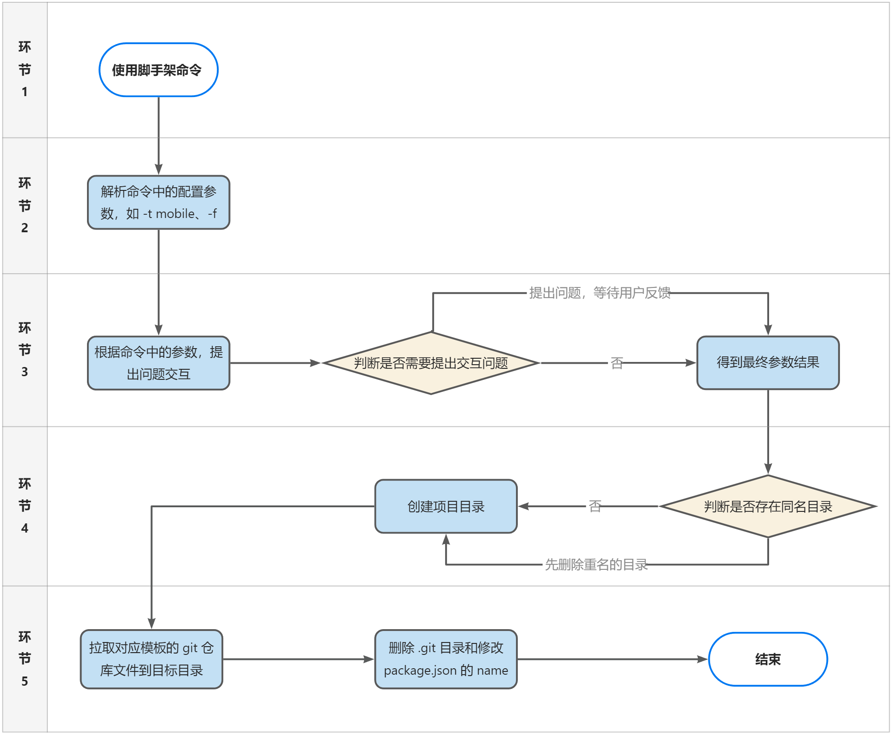

## 一、动机
随着前端技术的快速发展，新项目启动的速度和灵活性成为了提升开发效率的关键因素之一。然而，在实际工作中，我们经常面临以下挑战：
- **重复劳动**：每次新项目都需要从头开始设置环境，编写基础代码。
- **一致性问题**：不同项目间的基础配置不一致，导致维护成本增加。
- **效率低下**：手动配置和搭建环境耗时较长，影响整体开发进度和存在稳定性问题。

相信你们都有过这样的经历：面对新项目时，要么从零开始搭建，要么从旧项目中删除无关的业务代码，保留初始配置，然后再开始新项目的开发。偶尔这样做还可以接受，但如果频繁进行这种操作，不仅令人厌烦，而且难以保证项目的纯净度——很容易出现漏删或误删的情况。

此外，由于团队成员的选择不同，也可能会导致采用多种技术栈的不同项目并存，这就增加了维护的复杂性。

当然也可能的一种情况是公司内部已经有了初始配置的项目模板。在这种情况下，我们可能会直接去找对应的 Git 仓库然后创建项目。这种方法确实可行，但在实际操作中可能会遇到一些问题：如果仓库正在迭代中，可能会导致模板不稳定或存在未知问题或导致比较困惑。或者如果分支说明不够清晰，可能会导致选择错误的模板或版本。或者如果存在多个仓库，需要在多个地方寻找合适的模板，增加了查找和管理的难度。 

所以这时候就需要一个脚手架来为前端开发提速。
## 二、目标
为了解决上述问题，从而开发了 `create-yz` 轻量级脚手架工具，通过执行脚手架的命令就可以快速的搭建前端项目，让开发者专注于核心的业务开发。
通过 `create-yz` 希望能够为前端开发团队带来更高的生产力和更好的开发体验：
- **简化项目启动**：通过提供与目前团队适配、标准化的配置和模板，让项目启动变得更加简单快捷。
- **团队提效**：减少重复工作，使得团队成员能够更快地投入到核心业务逻辑的开发中。
- **保证一致性**：确保所有项目都遵循相同的规范和约定，降低后期维护的成本。
- **技术沉淀**：通过对以往业务和功能的总结与提炼，将公共组件和常用方法进行沉淀，为新项目提供了更多可复用的能力，提升开发效率和项目的质量。

## 三、核心
### 1. 介绍
脚手架本质上是一个工具，其目的是帮助我们摆脱构建工程时的**重复性**工作，尤其是在工程具有一定的**通用性**时，脚手架的重要性尤为突出。它使我们能够通过一行简单的命令快速初始化整个项目，无需费心费力地配置环境、安装依赖或解决依赖冲突等问题。

提到“脚手架”（Scaffold）这个词，相信你并不陌生。它源自建筑行业的术语，指的是为了保证施工过程顺利而搭建的工作平台，为工人们在各个楼层施工提供了必要的支撑和便利。

而在软件开发领域，脚手架是指通过各种工具来生成项目基础代码的技术。通过脚手架工具生成后的代码，通常已包含了项目开发流程中所需的工作目录内的通用基础设施，使开发者可以方便地将注意力集中到业务开发本身。

### 2. 需求
目前搭建了两个前端启动模板：[admin-starter](http://git.yzwill.cn/yz-web/admin-starter.git)、[mobile-starter](http://git.yzwill.cn/yz-web/mobile-starter.git)，分别对应着中后台管理系统和移动端应用的启动模板（介绍文章：[admin-starter-wiki](https://www.tapd.cn/44062861/markdown_wikis/show/#1144062861001005601)、[mobile-starter-wiki](https://www.tapd.cn/44062861/markdown_wikis/show/#1144062861001005756)）

基于此，第一个版本的脚手架功能需求比较简单，大致为：
1. 用户输入脚手架命令，准备创建项目。
2. 脚手架解析用户命令，并显示交互式问题，询问用户创建项目的名称和模板。
3. 用户填写项目名称和选择对应启动模板。
4. 脚手架根据用户的选择来创建项目和下载模板对应 Git 仓库代码。

解析成开发需求就是：
1. 创建并声明一个脚手架命令，并发布的 NPM 上
2. 对用户输入的脚手架命令的参数进行解析
3. 在命令行上显示交互问题和获取用户的反馈
4. 根据最终结果，来创建新目录和拉取对应代码到目录中



### 3. 参考项目
参考现有的一些优秀项目：
- [create-vue](https://github.com/vuejs/create-vue)
- [create-unibest](https://github.com/codercup/create-unibest)
- [create-uni](https://github.com/uni-helper/create-uni)
- [create-neat](https://github.com/xun082/create-neat)
- [vue-cli](https://github.com/vuejs/vue-cli)

### 4. 实现
####  4.1. 项目目录
```md
create-yz                      
├─ dist                        
│  └─ outfile.cjs              # 打包后的文件
├─ scripts                     # 脚本
│  └─ build.js                 # 打包脚本
├─ src                         # 源码
│  ├─ question                 # 交互问题
│  │  ├─ template              # 模板
│  │  │  ├─ index.ts           # 模板交互问题
│  │  │  ├─ templateData.ts    # 模板数据
│  │  │  └─ type.d.ts          # 类型声明
│  │  ├─ file.ts               # 文件覆盖的交互问题
│  │  ├─ index.ts              # 交互问题处理
│  │  └─ name.ts               # 文件名交互问题
│  ├─ types                    # 类型声明
│  │  └─ figures.d.ts          # prompts figures 类型声明
│  ├─ utils                    # 工具函数
│  │  ├─ banners.ts            # 头部信息 console.log
│  │  ├─ canSkipEmptying.ts    # 检查是否可以跳过清空目录
│  │  ├─ cloneRepo.ts          # 克隆仓库
│  │  ├─ directoryTraverse.ts  # 遍历目录
│  │  ├─ emptyDir.ts           # 清空目录
│  │  ├─ getCommand.ts         # 获取命令
│  │  ├─ index.ts              # 工具函数处理
│  │  ├─ loading.ts            # 命令行 loading
│  │  ├─ printFinish.ts        # 打印结束信息
│  │  └─ setPackageName.ts     # 设置 package.json name
│  └─ index.ts                 # 主入口
├─ commitlint.config.js        # commitlint 配置
├─ eslint.config.js            # eslint 配置
├─ LICENSE                     # 开源协议
├─ package.json                # 项目信息
├─ pnpm-lock.yaml              # 依赖信息
├─ README.md                   # 项目说明
└─ tsconfig.json               # tsconfig 配置
```
#### 4.2. 实现流程
- **(1) 定义主入口函数，并初始化**
```
// src/index.ts
#!/usr/bin/env node
function init() {
	// 核心实现
	...
}

init().catch((e) => {
  loading.fail(`${bold('模板创建失败！')}`)
  console.error(e)
})
```
在脚手架入口文件的顶部，添加 `#!/usr/bin/env node`，说明是可执行脚本，并通过用户系统的环境变量中找 node 的执行程序。
- **(2) 通过 `minimist` 解析命令行参数**
```
function init() {
	const argv = minimist(process.argv.slice(2), {
    // 设置模板类型的别名，方便使用短选项
    alias: {
      templateType: ['t'],
      force: ['f'],
    },
    string: ['_'],
  })
  ...
}
```
目前支持 templateType 和 force 参数使用，分别是作用于指定模板和强制覆盖重名文件夹的参数，并支持使用对应别名简写参数解析，如 `--t xxx` 或 `-f`。
- **(3) 根据命令行参数，判断是否需要添加交互问题**
主动发起一个交互式问题异步调用，并把用户的反馈赋值给 result。
```
// src/index.ts
function init() {
	...
	try {
		// 问题交互
		result = await question(argv)
	 }
	 catch (cancelled) {
		// eslint-disable-next-line no-console 
		console.log((<{ message: string }>cancelled).message)
		process.exit(1)
	 }
	 ...
}
```
> 这里使用了 `// eslint-disable-next-line no-console`，是因为开启了 eslint 的 no-console 配置，对 console 的使用进行警告，这样做是因为在脚手架使用过程中，**避免不必要的 console 信息出现在用户交互中**。也许是有时候调试忘记删除了，造成用户体验不佳。

```
// src/question/index.ts
export async function question(argv: ParsedArgs) {
  const questions = []
  const pName = argv._[0]

  // 如果命令行参数中没有提供项目名，则添加一个项目名的问题
  if (!pName) {
    questions.push(...projectName())
  }
  // 如果存在项目名称，则判断是否已存在相同文件名，是则添加一个是否文件覆盖的问题
  else if (!canSkipEmptying(pName) && !argv?.f) {
    questions.push(...filePrompt(pName))
  }

  // 如果命令行参数中没有提供模板，则添加一个模板选择的问题
  if (!argv?.t || argv?.t === true) {
    questions.push(template())
  }
  // 定义一个取消操作时的回调函数，用于抛出异常终止程序
  const onCancel = () => {
    throw new Error(`${red(figures.cross)} ${bold('操作已取消')}`)
  }

  // 使用 prompts 库提出问题，并等待用户输入答案
  const answers = await prompts(questions, { onCancel })

  return answers
}
```
在 question 方法中，通过对用户输入的命令行参数来判断是否需要添加交互问题数据，并使用 `prompts` 来提出交互式问题，等待用户交互，并返回反馈结果。

- **(4) 根据命令行参数和用户反馈结果，得到最终参数**
```
...
const { 
	projectName = argv._[0],
	shouldOverwrite = argv.f,
	templateType = templateList.find(item => item.value.type === argv.t).value
} = result
...
```

- **(5) 创建目录**
使用 `import { existsSync, mkdirSync } from 'node:fs'` 方法来根据用户定义的项目名称判断是否重名需要清空，并创建项目目录。

- **(6) 拉取仓库代码**
根据用户选择的模板对应的仓库地址，利用 `import { exec } from 'node:child_process'` 方法来执行克隆仓库代码操作：
```
...
const execStr = `git clone ${url} ${localPath} ${branch ? `-b ${branch}` : ''}`
exec(execStr, async (error) => {
	if (error) {
	  console.error(`${red('exec error:')} ${error}`)
	  reject(error)
	  return
	}
	try {
	  await removeGitFolder(localPath)
	  resolve()
	} catch (error) {
	  reject(error)
	}
})
...
```
- **(7) 处理项目代码**
使用克隆的方法拉取代码后，代码中会存在 .git 文件需要删除以及 package.json 的 name 需要修改。
```
import { existsSync, rmdirSync, unlinkSync,readFileSync, writeFileSync } from 'node:fs'
import { postOrderDirectoryTraverse } from './directoryTraverse'
import { join } from 'node:path'

export function emptyDir(dir: string) {
  if (!existsSync(dir))
    return
  postOrderDirectoryTraverse(
    dir,
    // 当遍历到目录时，使用 rmdirSync 立即删除该目录
    dir => rmdirSync(dir),
    // 当遍历到文件时，使用 unlinkSync 立即删除该文件
    file => unlinkSync(file),
  )
}

export function replaceProjectName(root: string, name: string) {
  const projectName = name.toLocaleLowerCase().replace(/\s/g, '-')
  const pkgPath = join(root, 'package.json')
  const fileContent = JSON.parse(readFileSync(pkgPath, 'utf8'))

  // 更新 package.json 中的项目名称
  fileContent.name = projectName

  writeFileSync(pkgPath, JSON.stringify(fileContent, null, 2))
}
```
### 5. 使用流程
#### 5.1. 使用已发布的 NPM 包

> 建议添加上标记名（@latest），否则可能会解析到缓存的过时软件包版本。

```bash
# 使用 pnpm 
pnpm create yz@latest
pnpm create yz <项目名称>
pnpm create yz <项目名称> -t <模板名>

# 或使用 npm
npm create yz@latest my-project -t mobile
npm init yz@latest my-project -t admin

# 或全局安装
npm install create-yz
create-yz  my-project
```
#### 5.2. 使用私服 NPM 包
```
# 安装 nrm 管理 npm 源
npm i -g nrm
# 添加源
nrm add yzNpm http://47.106.84.150:4873/
# 切换源
nrm use yzNpm

pnpm create yz@latest

# 或者在使用时指定源
pnpm create yz@latest --registry=http://47.106.84.150:4873/
```
### 6. 开发流程
#### 6.1. node 开发调试

- `pnpm build`，得到 `dist/outfile.cjs`（修改代码后需要重新构建）
- `pnpm dev` 运行 `node dist/outfile.cjs`
- `pnpm dev my-project -t mobile -f` 可以直接在命令后加参数进行调试
```bash
pnpm i
pnpm build
pnpm dev
# 带参数执行命令
pnpm dev my-project
pnpm dev my-project -t mobile -f
```
#### 6.2. link 调试

- pnpm build，得到 `dist/outfile.cjs`
- 执行 `npm link`（软链接），就能在本地执行 `bin` 中设定的指令进行实时的开发调试了
- 查看全局依赖 `npm ls -g --depth=0`
- 删除本项目的全局依赖 `npm unlink create-yz -g`
```bash
pnpm i
pnpm build
npm link

# 查看
npm ls -g --depth=0
# +-- create-yz@1.1.1 -> D:\repo\cli\create-yz # 已经 link 到当前项目

# 开发调试
create-yz
create-yz my-project
create-yz xx -t admin
```
## 四、其他
### 1. loading
思考一下命令行中的 loading 加载状态怎么实现？一般都是直接使用 Ora 库来实现，在这项目中则使用了精简后的版本：
```typescript
// src/utils/loading.ts
import process from 'node:process'

const frames = ['⠋', '⠙', '⠹', '⠸', '⠼', '⠴', '⠦', '⠧', '⠇', '⠏']
export class Ora {
  private message: string
  private interval: NodeJS.Timeout | null
  
  constructor(message: string) {
    this.message = message
    this.interval = null
  }
  start(): Ora {
    let i = 0
    this.interval = setInterval(() => {
      process.stdout.write('\r' + `${frames[i % 9]} ${this.message}`)
      i++
    }, 100)
    return this
  }
...
}

export function ora(message: string) {
  return new Ora(message)
}
```
代码非常简单，定义了一个 `Ora` 类，并通过工厂函数，返回 Ora 类实例，而其核心逻辑就是动画帧（逐步的加载状态）从 `frames` 数组中循环选取，使用 `setInterval` 每隔 100 毫秒利用 `process.stdout.write` 更新命令行输出 ，从而实现动画的加载效果，当然你也可以尝试不同的字符来实现不一样的动画效果。
### 2. 相关工具
简单介绍此脚手架工具使用到的依赖：
- [prompts](https://github.com/terkelg/prompts)：轻量级的、交互式的命令行提示
- [minimist](https://github.com/minimistjs/minimist)：轻量级的解析命令行参数
- [kolorist](https://github.com/marvinhagemeister/kolorist)：轻量级的使命令行输出带有色彩
- [commitlint](https://github.com/conventional-changelog/commitlint)：规范化 Git 提交信息工具
- [eslint](https://github.com/eslint/eslint) ：静态代码分析工具
- [simple-git-hooks](https://github.com/toplenboren/simple-git-hooks)：轻量的 Git 钩子管理工具
- [lint-staged](https://github.com/lint-staged/lint-staged)：在 Git 暂存文件(被 git add 的文件)上运行 linters，确保提交的代码符合规范
- [esbuild](https://github.com/evanw/esbuild)：极速 JavaScript 现代构建工具
- [bumpp](https://github.com/antfu-collective/bumpp)：交互式简洁高效的版本管理命令行工具
- [@antfu/eslint-config](https://github.com/antfu/eslint-config)：[Anthony Fu](https://github.com/antfu) 开源的 eslint 预设配置，开箱即用 。值得注意的是这配置是"**旨在在没有 Prettier 的情况下独立使用**"（感兴趣的可以了解下：[为什么我不使用 Prettier](https://antfu.me/posts/why-not-prettier-zh)）

### 3. 私有 NPM 库 - Verdaccio
前端团队在开发过程中经常会遇到需要沉淀一套通用的 UI 库、工具类和脚手架的情况。这些组件可能不允许在公网发布，或不适合开源，或为了确保项目应用的稳定性等因素限制，内网搭建 NPM 私有库的需求应运而生。通过 NPM 私有库管理这些组件，可以更好地控制访问权限，确保团队内部协作的安全性，提高开发效率，并完善前端建设。
首选 **verdaccio** 来搭建私有 NPM 库，搭建和部署的过程就不展开介绍了，相对比较简单，目前是部署地址是 `http://47.106.84.150:4873/`。
### 4. 发布
发布 NPM 包时，需要注意：
	- `package.json` 的 name 设置是否与线上其他 npm 包的名称重复，可以使用 npm search xxx 查询。
	- `package.json` 的 version 版本必须要比上一次发布的版本要大，可以使用 `npm run release` （bumpp）进行版本管理
	- 脚手架的使用命令定义，即 bin 属性的设置，如 `bin: {"create-yz": "node dist/outfile.cjs"}`，也就是定义用户使用的脚手架指令为 create-yz。
	- 为确保发布的版本都是最新的内容，需要发布前进行构建，运行 `pnpm build` 生成 **dist/oufile.cjs**，当然也可以在 package.json 的 scripts 中添加 `"prepublishOnly": "pnpm build"` 脚本，这样每次发布的都会构建最新的文件。
```sh
# 构建
pnpm build
# 登录授权
npm login # 可以使用 npm whoami 查看当前登录信息
# 发布
npm publish --access=public
```
> 注意：如果发布到 npm 时，出现超时或一直处于加载中亦或者发布不成功等问题，可以排查一下：
> 1. npm 源是否正确设置，执行 `npm config get registry` 查看当前设置，或使用 nrm use taobao 切换正确的 npm 源，或检查是否项目中 .npmrc 文件的设置（如`registry=https://registry.npmjs.org/`）。
> 2. 是否有使用科学上网，因为 npmjs 属于国外服务器。
> 3. 检查 npm 代理是否正确设置，如 `npm config set proxy http://127.0.0.1:10809`，`npm config set https-proxy http://127.0.0.1:10809`，10809 为实际代理的端口。（恢复： `npm config set proxy null`，`npm config set https-proxy null`）
> 
## 五、**规划**
目前脚手架的功能比较简单，未来还会持续地进行迭代和优化：
- 修改代码，支持自动构建最新的文件
- 模板选择支持版本管理，可以根据 Git 仓库获取最新的分支情况来选择
- 丰富模板内容，如提供功能和组件示例的更多模板、提供可选的业务功能等
- 脚手架本地版本号对比，提示安装最新版本
- 添加一些辅助功能，如
	- 选择包管理器
	- 初始化 git 
	- 脚手架参数提示 --help 
	- 增加项目简介、项目作者等关键信息可选填写
- 实现插件化，可以自由的进行扩展。
- 等等

## 六、总结
一开始我们说明了脚手架的动机和目标，create-yz 是一个轻量级的脚手架工具，旨在简化项目启动流程，减少重复工作。该工具通过标准化配置和模板，提高团队协作的一致性和降低维护成本，快速简单地搭建前端项目，让开发者专注于核心业务。

然后阐述了当前实现的脚手架 create-yz 功能，提供两个前端启动模板，适用于中后台管理和移动端应用，并通过简单命令初始化项目，减少重复配置工作。

同时介绍了脚手架的实现流程，通过解析命令行参数、用户交互反馈和创建目录并拉取模板等流程，完成项目的自动化创建。

接着介绍了脚手架的 loading 实现和使用到的第三方工具，以及私有 NPM 库 - Verdaccio 的搭建，并在最后对脚手架展开未来规划。

搭建一个脚手架，能很好地锻炼到开发者的 nodejs 掌握、工程化能力、以及工具服务的设计能力，是前端进阶一个好机会，如果你还没试过，建议你也动手尝试一下，当然如果你有好的建议或想法，欢迎一起共建~
