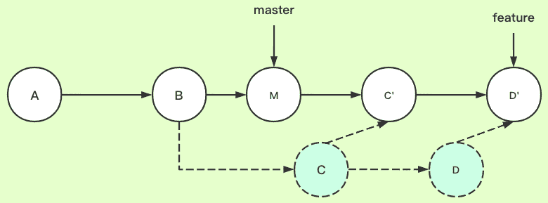

本文档旨在记录一些在实际开发工作中用到的实用且高效的 Git 命令和技巧，帮助大家更加高效地使用 Git 进行版本控制。

## 1. git stash
非常喜欢的一个命令，`git stash` 适用于临时保存当前工作目录中的更改，以便稍后恢复。它可以让你在切换分支或执行其他操作时，暂时“隐藏”当前的工作进度。
### 1.1. 使用场景
- **切换分支**：当你正在一个分支上工作，但需要切换到另一个分支时，可以使用 git stash 保存当前的工作进度，然后再切换回原来的分支时恢复。
- **清理工作目录**：当你需要一个干净的工作目录来执行某些操作（如构建、测试等）时，可以使用 git stash 临时保存更改。
- **保存未完成的工作**：当你需要暂时离开，但又不想丢失当前的工作进度时，可以使用 git stash 保存。
### 1.2. 命令使用
- **git stash save [message]**：保存当前工作目录中的更改到 stash 列表中，并附带一条可选的消息。（如果直接执行 git stash 命令会基于最近一次提交的信息来创建一个 stash）
- **git stash list**：列出所有已保存的 stash。
- **git stash apply [stash@{n}]**：应用指定的 stash 到当前工作目录中，保留原来的 stash。
- **git stash pop [stash@{n}]**：应用并删除指定的 stash。
- **git stash drop [stash@{n}]**：删除指定的 stash。
- **git stash clear**：删除所有 stash。
### 1.3. 操作步骤
```shell
# 1. 保存当前的工作进度
git stash save "Temporary changes" # 或者使用简写 git stash

# 2. 查看所有已保存的 stash
git stash list

# 3. 应用 stash 到当前工作目录中
git stash apply 0 # 或者使用 git stash pop (0 | @0)

# 4. 删除指定的 stash
git stash drop @0
```
## 2. git pull --rebase
先了解 `git merge` 和 `git rebase`，它两都是用于分支合并，**关键在 commit 记录的处理上不同**：
- git merge 会新建一个新的 commit 对象，然后两个分支以前的 commit 记录都指向这个新 commit 记录。这种方法会保留之前每个分支的 commit 历史。
- **git rebase**，它是 git merge 命令的一个替代方案，是一个线性的合并过程，它会先找到两个分支的第一个共同的 commit 祖先记录，然后将提取当前分支这之后的所有 commit 记录，然后将这个 commit 记录添加到目标分支的最新提交后面。经过这个合并后，两个分支合并后的 commit 记录就变为了线性的记录，它可以帮助你整合分支，**使历史更加线性，更简洁**。


| | | |
|:-|:-:|:-:|
| |**git rebase**|**git merge**|
|用途|将当前分支的修改应用于另一个分支|将两个分支的修改合并为一个新的提交|
|优点|线性提交历史，避免了合并冲突|可以更好地保留分支的历史和结构|
|缺点|**可能会产生冲突**，需要小心处理|可能会产生非线性提交历史，增加代码审查和维护的难度|
|使用场景|在从公共分支拉取时更新本地分支|在一个功能分支开发完成后将其合并到主分支上|
|操作方法|使用 rebase 命令将当前分支 rebase 到目标分支|使用 merge 命令将目标分支合并到当前分支|

总体而言，git merge 更适合在不同的分支之间进行协作开发，并且需要保留每个分支的历史记录和结构，而 git rebase 则更适合在一个分支上开发并且需要保持提交历史的线性结构。由于倾向于只保留一个长期分支 release 的 Git 工作流，所以比较推荐使用 **rebase** 的用法。

git rebase 的基础使用就不展开了，下面推荐一个比较实用的命令：`git pull --rebase`
### 2.1. 基本用法
**git pull --rebase** 用于将远程仓库的最新更改应用到本地分支上，同时使用 rebase 而不是普通的合并（merge）。
```shell
git pull --rebase <remote> <branch>
# <remote> 和 <branch> 可省略，默认使用当前定义的远程仓库和跟踪分支
```

### 2.2. 使用场景
- **更新本地分支**：当你需要将远程仓库的最新更改应用到你的本地分支上，同时保持提交历史的线性。
- **避免合并提交**：如果你希望避免在合并过程中产生额外的合并提交。
- **简化历史**：当你希望提交历史更加清晰，更容易追踪更改时。

### 2.3. 操作步骤

```shell
# 1. 执行命令
git pull --rebase 
# 或者指定远程仓库和分支 git pull --rebase origin main

# 2. 解决冲突（如有）
# 如果在 rebase 过程中有冲突，git 会暂停 rebase 并提示你解决冲突

# 3. 遇到无法解决的冲突或其他问题时，可以选择放弃 rebase 
git rebase --absort

# 4. 解决冲突后，添加解决冲突后的文件
git add <conflicted-file>

# 5. 继续 rebase 过程
git rebase --continue
```

##  3. git reflog
**`git reflog`** 用于查看仓库的历史记录，包括对 HEAD、分支和其他引用的更改历史。

### 3.1. 使用场景

- **恢复丢失的提交**：当你不小心删除或覆盖了提交，并希望恢复这些提交时。
- **追踪历史更改**：当你需要了解某个引用（如分支或标签）的历史更改时。
- **解决冲突**：当你在 rebase 或其他操作中遇到问题时，可以使用 reflog 来查找问题的原因。

### 3.2. 操作步骤
```shell
# 1. 查看 reflog 记录
git reflog # 或者查看特定引用记录 git reflog master

# 2. 查找需要提交记录 <commit>，进行恢复或检出
git reset --hard <commit>
git checkout <commit>
```

## 4. git reset
`git reset` 用于重置 HEAD 或其他引用到指定的提交，并可选择性地更新工作树中的文件。

### 4.1. 使用场景
- **撤销最近的提交**：当你想撤销最近的一次或多次提交时。
- **恢复丢失的提交**：当你不小心删除或覆盖了提交，并希望恢复这些提交时。
- **清理工作树**：当你需要清理工作树中的未提交更改时。
- **解决冲突**：当你在 rebase 或其他操作中遇到问题时，可以使用 git reset 来回到一个干净的状态。

### 4.2. 命令使用
- **`git reset <commit>`**：将 HEAD 重置到指定的提交。
- **`git reset <file>`**：将工作树中的文件重置为与索引中相同的状态。
- **`git reset <commit> <file>`**：将文件从工作树中移除，并将索引中的文件重置为与指定提交中相同的状态。
	
### 4.3. 可选项
- **--soft**：只移动 HEAD 指针，不会改变索引或工作树中的任何文件。
- **--hard**：移动 HEAD 指针，并将索引和工作树中的文件重置为与指定提交中相同的状态。
- **--merge**：将索引中的文件重置为与指定提交中相同的状态，并尝试合并工作树中的文件。
- **--patch**：交互式选择要重置的文件的部分内容。
	
### 4.4. 操作步骤
```shell
# 1. 撤销最近的 n 次提交
git reset --soft HEAD~1

# 2. 创建新的提交
git commit -m "Revert the previous commit"

# 3. 强制推送（修改了已推送的提交历史）
git push --force # 或者 git push -f
```
	
## 5. git revert
**`git revert`**：此命令用于撤销一次或多次提交，但不同于 `git reset`，它通过创建一个新的提交来撤销指定提交的更改，而不是直接删除或修改历史记录。这意味着它不会改变项目的历史线，而是将撤销操作作为历史的一部分记录下来。

### 5.1. 基本用法
- **`git revert <commit>`**：撤销指定的单个提交，并创建一个新的提交来恢复到该提交之前的状态。
- **`git revert <commit>..<commit>`**：撤销一系列连续的提交。
	
### 5.2. 使用场景
- **撤销已推送的提交**：当需要撤销已经推送到远程仓库的提交时，使用 git revert 是一种安全的方式，因为它不会重写历史。
- **修正错误**：如果你发现之前的提交中存在错误，但又不想丢失这部分历史记录，可以使用 git revert 来撤销错误的更改。
- **团队协作**：在多人协作的项目中，使用 git revert 可以避免因重写历史而导致的协同工作混乱。

### 5.3. 操作步骤
```shell
# 1. 确定要撤销的提交
git revert <commit> # 或者 git revert <commit>..<commit>

# 2. 解决冲突（如有）
# 如果撤销操作导致冲突，Git 会暂停并要求你手动解决冲突

# 3. 提交和推送变更，完成撤销操作
git add .
git commit -m 'revert'
git push
```
## 6. git cherry-pick
**`git cherry-pick`** 用于将一个或多个提交应用到当前分支的最新提交之上，可以让你有选择地合并提交，并保留项目的完整历史记录。
### 6.1. 基本用法
- **`git cherry-pick <commit>`**：将指定的提交应用到当前分支的最新提交之上。
- **`git cherry-pick <commit>..<commit>`**：将一系列连续的提交应用到当前分支的最新提交之上。

### 6.2. 使用场景
- **合并特定提交**：当你只想将某个特定提交合并到当前分支，而不是整个分支时。
- **修复已发布的版本**：当你需要将一个修复提交应用到已经发布的版本分支上时。
- **跨分支应用更改**：当你需要将一个分支上的更改应用到另一个分支上时。

### 6.3. 操作步骤
```shell
# 1. 将指定的提交应用到当前分支
git cherry-pick <commit>

# 2. 解决冲突（如有）
# 如果 cherry-pick 导致冲突，git 会暂停并要求你手动解决冲突

# 3. 推送变更，完成 cherry-pick 操作
git push
```

## 7. git add -p
**`git add -p`** 用于交互式地添加文件或文件的部分内容到暂存区，可以让你挑选改动提交。
### 7.1. 使用场景
- **精细控制提交内容**：当你只想提交文件中的某些更改，而不是整个文件时。
- **逐步提交**：当你需要逐步添加文件的不同部分到暂存区时。
- **解决冲突**：在解决冲突后，使用 git add -p 可以选择性地添加解决冲突后的更改。
### 7.2. 操作步骤
```
# 1. 进入交互式模式
git add -p

# 2. 选择要添加的文件
# 在交互式模式中，git 会列出所有未暂存的更改，并询问你是否要添加每个文件或文件的部分内容。如:
# diff --git a/file.txt b/file.txt 
# index 1234567..7654321 100644 
# --- a/file.txt 
# +++ b/file.txt 
# @@ -1,5 +1,6 @@ 
#  line1 
#  line2 
# -line3 
# +line3 modified 
#  line4 
#  line5 
# (1/1) Stage this hunk [y,n,q,a,d,j,J,g,/,e,?]?

# 3. 使用 git commit 提交暂存区中的更改
git commit -m 'xxx'
```
在交互模式中， `Stage this hunk [y,n,q,a,d,j,J,g,/,e,?]?` 的相关说明：
- hunk：是指每个更改
- y (yes)：将当前 hunk 添加到暂存区
- n (no)：不将当前 hunk 添加到暂存区
- q (quit)：退出交互式模式
- a (all)：将当前文件的所有 hunk 添加到暂存区
- d：不将当前 hunk 和当前文件后续任何 hunk 添加到暂存区
- j：让当前 hunk 未定，跳转下一个未定的 hunk
- J：让当前 hunk 未定，跳转下一个 hunk
- k：让当前 hunk 未定，跳转上一个未定的 hunk
- K：让当前 hunk 未定，跳转上一个 hunk
- g：选择当前文件中的 hunk 进行跳转
- /：允许你输入一个字符串来搜索包含该字符串的 hunk
- e (edit)：手动编辑当前改动
- ? (help)：显示帮助信息

## 8. 修改 .gitignore 不生效
如果某些文件已经加入了版本管理，现在重新加入 .gitignore 是不生效的，需要执行下面的操作：
```shell
# 针对某些文件
git rm -r --cached file1 file2 
# 针对某些文件夹
git rm -r --cached dir1 dir2 
# 针对所有文件
git rm -r --cached . 
```
## 9. 拉取远程的某个分支到本地
在实际开发工作中，经常需要从远程仓库拉取特定的分支到本地进行开发或合并。
**针对已经拉取了仓库的某个分支，需要拉取远程的其他某一个分支到本地，并且本地分支应跟踪远程分支的场景：**
- 方法1：创建并切换到新的本地分支，并跟踪远程分支
```shell
git checkout -b <local-branch> <remote>/<remote-branch>
// 如：git checkout -b release origin/release
```
- 方法2：直接拉取远程分支到本地，并切换到新的本地分支
```shell
git pull <remote> <remote-branch>:<local-branch>
git checkout <local-branch>
# 如：
# git pull origin release:release
# git checkout release
```


