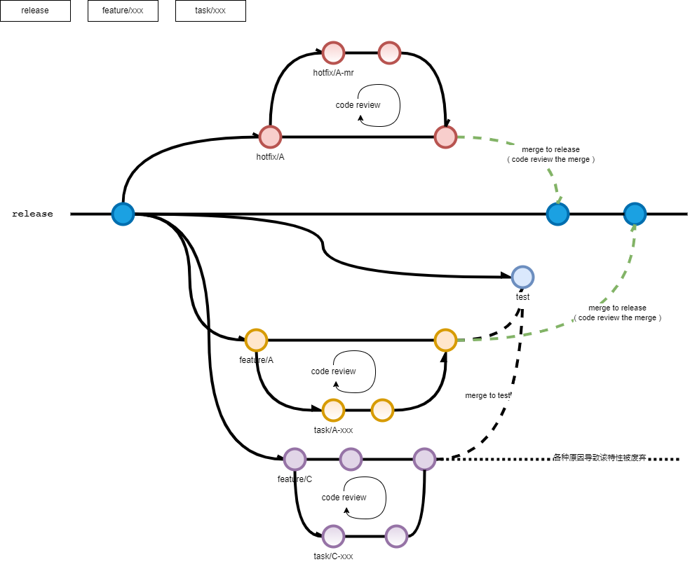

## 开发模式
为了实现发布功能可控，细化拆分任务的目标，形成统一的规范： 
**产品 => 迭代 => 功能 => 任务**
1. 强调了**功能**的这个节点。
	- 一个迭代包含多个功能
	- 功能之间相对独立解耦，不存在依赖关系
	- 功能作为集成上线的最小单位
2. 增加了**任务**节点
	- 任务是研发侧的最小工作项单位
	- 任务的最佳研发周期为 1~3天（基于接口协议开发，不包含联调）

## Git 工作流
Git 工作流与传统 git flow 有所区别，根据当前开发情况做了适配和简化，具体如下： 
1. 只保留一个长期分支 **release**
2. 需要开发新**功能**时，执行以下操作：
	2.1 从 release 检出相应的 **feature** 分支，如 feature/user-auth
	2.2 根据**功能**所包含的**任务**，从 feature 分支检出相应的 **task** 分支进行开发，如 task/user-auth-core
	2.3 在 task 分支完成开发后，发起 merge request ( 以下称 mr ) 到对应的 feature 分支，指派给对应的审查人进行 **code review**
	2.4 根据 review 的反馈，在对应 task 分支进行修改，完成后再次提交，直至完成 review 意见修改为止（ 需要预留 review 时间 ）
	2.5 如果开发任务非常紧急，而审查人又没有时间审查，为了不阻塞开发，可以后置审查
	2.6 在 code review 通过后，task 分支的代码并入对应的 feature 分支，并且 task 分支自身被**删除**
3. 需要修复生产环境 bug 时，执行以下操作：
	3.1 从 release 检出相应的 **hotfix** 分支进行修复，如 hotfix/pwd
	3.2 从 hotfix 分支检出相应的 hotfix pr 分支进行开发，如 hotfix/pwd-pr
	3.3 完成开发后，发起 mr 给对应的审查人进行 code review
	3.4 与上述开发新功能时 code review 步骤相同
4. 进入提测阶段，选择特定的**功能分支**合并为 **test** 分支，发布到测试环境
5. 提测阶段的 bug 修复在对应的 feature 分支上进行（按照 [git commit 提交规范](https://www.tapd.cn/44062861/markdown_wikis/show/#1144062861001005465)，打上修复标识，不需要进行 code review），完成后将对应的 feature 分支合入 test 即可
6. 准备发布到生产环境，选择需要发布的**功能分支**，提起 mr 到 release 分支，指派给对应的审查人进行 code review
7. 与上述 code review 步骤相同，但此时 code review 关注点与开发阶段不同，重点关注测试阶段的修复提交以及是否会引入不良因素到生产环境中)
整体的开发流程如图所示：

