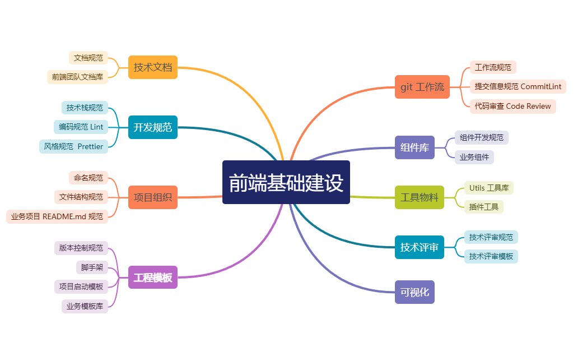

## Purpose
- 快速支撑业务开发
- 赋能业务开发流程
- 规范、统一、可维护
- 降本、提效、成长

## Category

## Roadmap

## Next

## Todo
- [ ] 基于接口文档生成 api 的 typescript 
- [ ] 文档规范
- [ ] 编程规范
- [ ] 代码审查 Code Review
- [ ] 业务组件库
- [ ] Utils 工具库
- [ ] eslint 
- [ ] commit lint
- [ ] 历史遗留的技术债务、重构事项
	- [ ] XXX
- [x] 前端团队文档库 · *2024-11-13*
- [x] 脚手架 yz-create · *2024-08-21*
- [x] 前端启动模板搭建-移动端、管理后台 · *2024-07-18*
- [x] Git Commit 提交规范 · *2024-05-06*
- [x] 前端技术评审规范 · *2024-04-19*
- [x] Git 研发工作流规范 · *2024-04-15*
