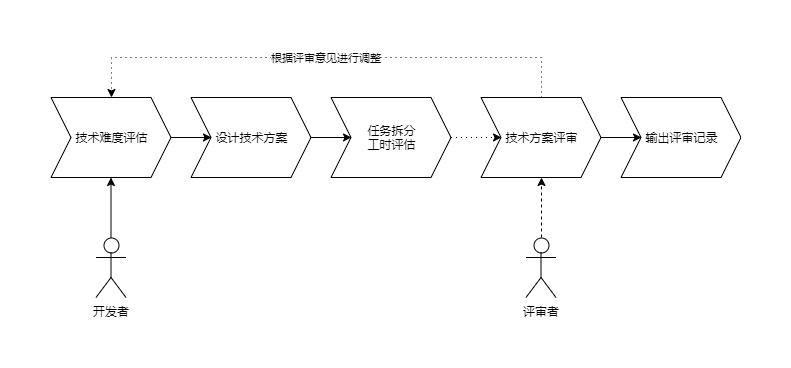

## 一、目标
前端技术评审是确保代码质量、功能完整性和业务逻辑正确性的重要手段。它有助于减少错误和漏洞，提高应用质量，以及确保代码符合业务需求。
1. 根据设计技术实现方案，结合众人之力分析设计是否存在不足，挖掘更多设计思路，旨在尽早发现在产品需求/功能实现过程中**可能存在的技术问题**，以**确保技术方案质量可控**，以避免返工，提升代码质量。
2. 通过对技术实现的整体流程进行梳理，拆分任务并进行工时预估，由相关人员进行规模预估的评审，尽可能及早发现风险和问题，避免因为估算偏差较大而导致**计划不受控制**。
3. 形成**文档化**，便于后期维护、回顾复盘、工作交接、沉淀通用解决方案等。
4. 通过清晰阐述方案，要求开发者深入理解需求并**保证输出方案的质量**。同时也需要开发者展现清晰的表达能力，这是锤炼个人能力的良机。

## 二、流程
对于从零开始的开发或迭代版本比较大（可依据工时评估大于 5 个人天为标准），前端技术评审通常是必要的，而对于一些简单的功能或需求，例如增删改查的需求，技术设计/评审就显得没那么必要了。
前端技术评审的节点是在需求评审和交互（UI）评审确认之后，整个流程的开始由前端开发者负责进行技术难度评估、设计实现方案、任务拆分和工时评估等工作，然后组织产品、测试、技术负责人等各方人员展开评审会议，并输出最终的评审记录和相关文档。

## 三、规范
### 1. 开发者
开发者的主要职责是负责技术难度评估、输出技术方案、拆分任务、预估工时、推进技术评审流程。
#### 1.1 技术难度评估
前端技术难度评估的标准可参考下列表格，按实际情况分析，可以对内容进行补充。
| 技术难度 | 前端判定标准标准 | 方案输出标准 | 归档要求 |
| :------: | ------ | ------ | ------ |
| 简单 |· 无业务变更风险 · 无性能风险 · 改动点影响范围单一|无|无|
| 标准|· 无复杂交互 · 有业务变更但风险可控 · 影响范围广但明确 · 小规模改动底层框架 · 引入新的小型第三方库 ···|· 改动组件 · 业务流程 · 影响范围 · 潜在风险 ···|1. 业务流程图 2. 代码逻辑图 ...|
| 复杂 |· 新项目/新业务 · 复杂交互 · 影响范围广 · 大规模改动底层框架 · 引入或升级 NPM 包依赖 · 组件库新增或者升级组件 · 引入新的基础设施组件 · 引入新的大型第三方库 ···|· 调研过程记录 · 选型依据 · 影响范围 · 潜在风险 · 组件文档 ···|1. 调研过程记录 2. 选型依据 3. 版本/配置变更流程 4. 业务流程图 5. 代码逻辑图 6. 交互时序图 ···|

#### 1.2 输出技术方案
根据需求进行技术难度等级评估后，输出相应标准的技术方案，归档 wiki 知识库。如判定为复杂难度或根据实际情况，应该主动地在该阶段邀请评审人进行提前沟通，明确思路。
相对于后端技术方案，前端的技术方案应该更关注**页面效果**、**页面间的跳转**、**组件交互**、**用户操作**。
前端技术方案的标准应该包含了以下关键信息（模板详见附录）：
- 1. **概述**
- 1.1 **需求背景**
简要阐述业务需求的背景和优先级，可以参考产品的需求文档。
- 1.2 前置概念（可选）
对产品名词进行理解和进一步阐述，包括语义化的和专业化的。
- 2. **相关文档**
列举涉及此次需求和设计方案的文档，后续可进行补充。
	- 需求文档：https://xxxx.com (产品：XXX)
	- UI 原型：https://xxxx.com (UI：XXX)
	- 接口文档： https://xxxx.com  (接口：XXX)
	- 冒烟用例：https://xxxx.com  (测试：XXX)
- 3. **总体设计**
- 3.1 **架构图**
添加整体需求全貌的架构图或流程图。
- 3.2 **参考规范**
提出需要遵循的技术规范或需要特别注意的限制，如目录规范、代码规范、提交规范等。
- 3.3 **风险评估**
预测存在的风险，如可能导致延期的方面、外部依赖的不确定性、旧功能兼容和历史数据处理、业务待确认等问题。
- 4. **关键业务/功能模块的实现**
列举出此次需求中比较关键或耗时的业务/功能模块的实现细节。
- 4.1 **技术选型**
新项目或新功能模块需要引入新的技术或框架时，需要进行技术选型，技术选型的依据可参考以下维度：
	- 可选范围
	- 适用性
	- 性能
	- 安全性
	- 可扩展性
	- 成本、收益、风险
- 4.2 **关键模块一**
- 4.2.1 **功能说明**
介绍该模块的具体功能，如期望效果、目前存在的限制，以及技术难点、复杂度或潜在风险，同时告知测试人员需要重点关注。
- 4.2.2 **流程说明**
对功能流转进行说明，需包含正常流程和异常流程。
- 4.2.3 **模块详细设计**
从技术的角度讲述功能的实现思路，并按需设计对应的架构图。
	- 针对业务流程，建议画流程图；
	- 针对复杂的领域模型的状态变化，建议画状态图；
	- 针对不同领域的交互，建议画泳道图；
	- 针对复杂的技术方案，建议画架构图，流程图，类图等；
	- 针对复杂的交互设计，建议画用户交互图、时序图；
- 4.2.4 **补充说明**
可以对需要特别说明的接口要求，包括但不限于特殊的数据结构、数据处理、额外的参数等进行补充说明。此外，还可以补充前后端协商好的状态码和业务逻辑码，以及其他业务组件的外部依赖等信息。
- 4.3 **关键模块二**
......
- 5. **技术分析 Checklist**
- 
| 序号 | 技术分析自检项 | 自检结果 |
| :-: | - | :-: |
|1| 本次改造对原有功能需求的影响范围，包括以前交互，视觉设计 ||
|2| 是否可提取出公用组件||
|3| 数据结构变更是否考虑老数据兼容||
|4| 是否影响其他端(移动端、小程序端等）||
|5| 操作是否考虑了防重处理||
|6| 兼容性处理||
|7| 权限不同展示内容不同考虑||
|7| 复杂动画或交互实现||
|8| ······||
- 6. **项目排期**
- 6.1 **任务拆分、工时预估**
按照现有的工时评估模板，填入项目拆解后的详细任务工时，可附上线上的文档地址。
|端口|负责人|模块|内容|开发工时/h|自测工时/h|联调工时/h|冒烟测试/h|合计/h|日期|
|:-:|:-:|:-:|:-:|:-:|:-:|:-:|:-:|:-:|:-:|
- 6.2 **项目里程碑**
按照产品经理安排和实际情况，初步制定项目的里程碑，包括但不局限于以下内容:
| 事项 | 日期|
|:-:|:-:|
| 需求评审 | 202x 年 xx 月 xx 日 |
| 技术评审 | 202x 年 xx 月 xx 日 |
| 开发完成 | 202x 年 xx 月 xx 日 |
| 版本提测 | 202x 年 xx 月 xx 日 |
| 版本发布 | 202x 年 xx 月 xx 日 |
#### 1.3 推进技术评审流程
开发者应该积极主动推动技术评审流程，包括需求理解、技术方案的前期准备、前后端联调的协商沟通、组织开展评审会议等。
### 2. 评审者
开发者一般地可以邀请此需求一起开发的前端同事、前端负责人、技术经理作为评审者，建议邀请上测试、产品和后端人员一起参会，可按照实际情况邀请参会的人员。
评审者根据提交开发者的前端技术方案进行技术评审：
- **技术难度**维度：在当前开发者判断的技术难度基础上进行判定和提出异议或沟通、反馈，确保复杂方案设计的有效性。
- **技术方案**维度：对当前开发者提交的技术方案进行评审：
	- 可用于选型的范围
	- 选型本身的可靠性
	- 对需求的理解程度，或当前选型是否能够长期支持需求
	- 针对这个方案，实施可能遇到的细节问题是否有考虑到位
	- 是否具有良好的编程风格或符合编程规范
	- 是否具有良好的设计模式
- **任务拆分和工时预估**维度：识别任务拆分和工时预估中的问题或风险，帮助团队减轻估算偏差造成的计划变更。
- 评审结果：要求开发者记录评审问题，并输出过程文档，如评审不通过要求开发者调整修改后重新评审。
## 附录
- [前端技术评审模板](https://www.tapd.cn/44062861/markdown_wikis/show/#1144062861001005436) 
- 知识库中相关文章推荐
	- [技术设计模板参考-前端](https://www.tapd.cn/44062861/markdown_wikis/show/#1144062861001002681)
	- [如何设计技术方案](https://www.tapd.cn/44062861/markdown_wikis/show/#1144062861001003351)

## 思考（WIP）
- 前端技术评审的目的是什么？保证前端开发质量？提高开发效率？规范流程？
- 实施方案？落实的规划和期望？思考怎么更贴合团队的发展？怎么得到积极自发的支持？
- 评审者的选择是否合理？是否造成额外的工作量？
- 怎么形成正反馈、良性循环？

